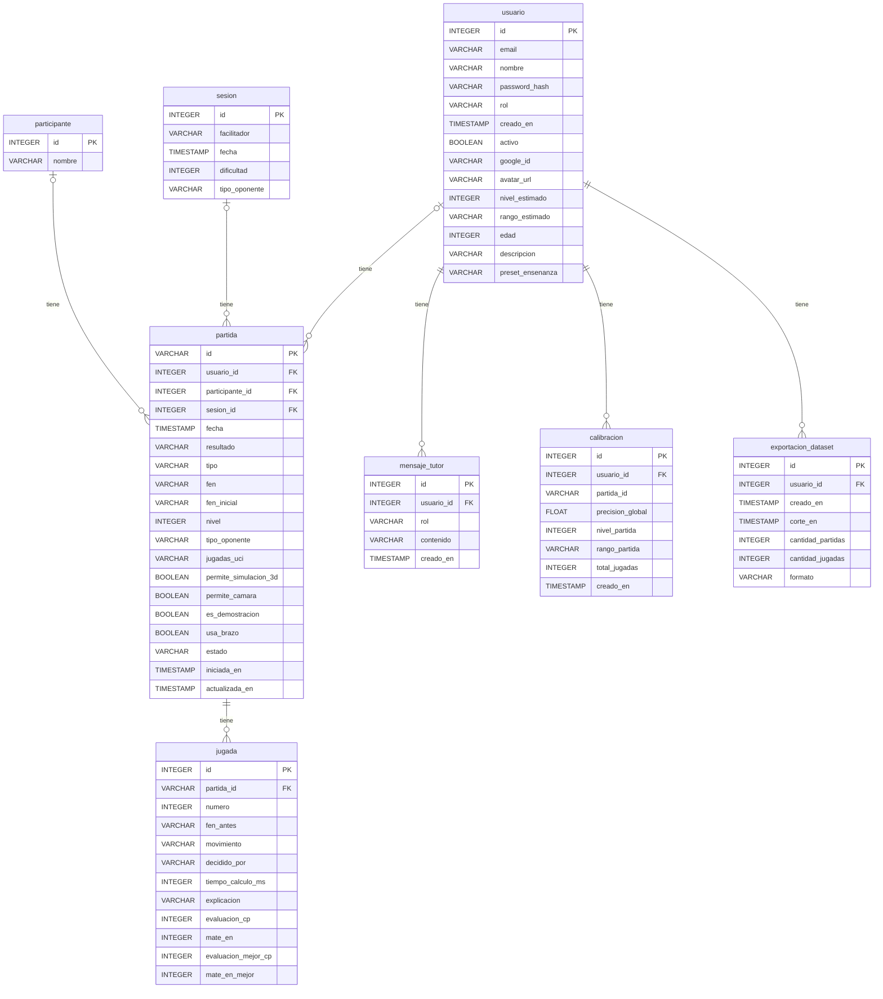
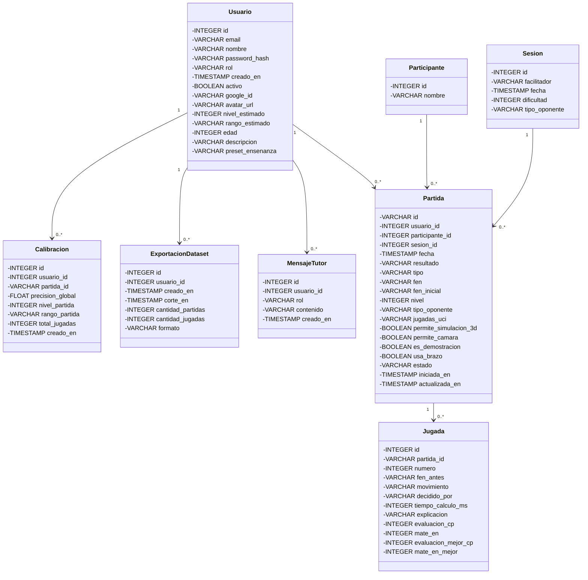

# Diccionario de datos

Generado automáticamente desde `backend/modelos/tablas_orm.py` con `docs/base_de_datos/generar_esquema.py`. No editar a mano.

- Motor: PostgreSQL 16. La aplicación crea las tablas sola al arrancar; el script equivalente está en [base_completa.sql](base_completa.sql); para producción en Supabase, [base_supabase_produccion.sql](base_supabase_produccion.sql).
- Tablas: 8 (6 en uso, 2 reservadas para sesiones de clase).
- Sin `DATABASE_URL` configurada, la aplicación guarda las partidas en memoria y no usa estas tablas para ellas.

## Relaciones

| Origen | Destino | Cardinalidad | Significado |
| :-- | :-- | :-: | :-- |
| `usuario` | `partida` | 1 a N | Un usuario juega muchas partidas; una partida tiene un solo dueño (opcional). |
| `partida` | `jugada` | 1 a N | Una partida tiene muchas jugadas; se borran con la partida. |
| `usuario` | `mensaje_tutor` | 1 a N | Un jugador tiene su propio historial de conversación con Turing. |
| `usuario` | `calibracion` | 1 a N | Un jugador acumula una calibración por cada partida que sirvió para medirlo. |
| `usuario` | `exportacion_dataset` | 1 a N | Un facilitador acumula una fila por cada vez que descargó el dataset de partidas. |
| `participante` | `partida` | 1 a N | Opcional y reservada: una partida puede asignarse a un participante. |
| `sesion` | `partida` | 1 a N | Opcional y reservada: una partida puede pertenecer a una sesión de clase. |

## `participante`

Estudiantes de un curso, para sesiones del facilitador.

**Estado:** Reservada: el modelo existe pero ningún flujo la usa todavía

| Columna | Tipo | Nulo | Clave | Por defecto | Descripción |
| :-- | :-- | :-: | :-- | :-- | :-- |
| `id` | INTEGER | no | PK |  | Identificador del participante. |
| `nombre` | VARCHAR | no |  |  | Nombre del participante. |

## `sesion`

Sesión de clase que abre un facilitador, con su dificultad y tipo de oponente.

**Estado:** Reservada: el modelo existe pero ningún flujo la usa todavía

| Columna | Tipo | Nulo | Clave | Por defecto | Descripción |
| :-- | :-- | :-: | :-- | :-- | :-- |
| `id` | INTEGER | no | PK |  | Identificador de la sesión. |
| `facilitador` | VARCHAR | sí |  |  | Nombre del facilitador que la abrió. |
| `fecha` | TIMESTAMP WITHOUT TIME ZONE | no |  | now() | Fecha y hora de la sesión. |
| `dificultad` | INTEGER | sí |  |  | Nivel de dificultad de la sesión, de 0 a 20. |
| `tipo_oponente` | VARCHAR | sí |  |  | `motor`, `modelo` o `participante`. |

## `usuario`

Personas que usan el sistema, con su rol, su nivel de juego y su perfil.

**Estado:** En uso

| Columna | Tipo | Nulo | Clave | Por defecto | Descripción |
| :-- | :-- | :-: | :-- | :-- | :-- |
| `id` | INTEGER | no | PK |  | Identificador del usuario. |
| `email` | VARCHAR | no | único |  | Correo del usuario; es único y se usa para iniciar sesión. |
| `nombre` | VARCHAR | no |  |  | Nombre visible. |
| `password_hash` | VARCHAR | sí |  |  | Hash de la contraseña (nunca se guarda en claro). Nulo si entra solo con Google. |
| `rol` | VARCHAR | no |  | jugador | `jugador` o `facilitador`. |
| `creado_en` | TIMESTAMP WITHOUT TIME ZONE | no |  | now() | Fecha y hora de registro. |
| `activo` | BOOLEAN | no |  | True | Indica si la cuenta está habilitada. |
| `google_id` | VARCHAR | sí |  |  | Identificador de Google cuando entra con su cuenta de Google. |
| `avatar_url` | VARCHAR | sí |  |  | Ruta o URL de la foto de perfil. |
| `nivel_estimado` | INTEGER | sí |  |  | Nivel de juego vigente, de 0 a 20 (la escala del Skill Level de Stockfish). Lo recalcula el sistema al terminar cada partida, o lo fija el jugador como punto de partida desde su perfil. |
| `rango_estimado` | VARCHAR | sí |  |  | `Principiante` (niveles 0-6), `Intermedio` (7-13) o `Avanzado` (14-20). |
| `edad` | INTEGER | sí |  |  | Edad, de uso libre en el perfil. |
| `descripcion` | VARCHAR | sí |  |  | Biografía o trayectoria breve, de uso libre en el perfil. |
| `preset_ensenanza` | VARCHAR | sí |  |  | Tono con el que Turing habla: `infantil`, `estandar` o `adultos`. Lo elige el facilitador. |

## `calibracion`

Una fila por partida terminada que sirvió para medir el nivel del jugador. Con las últimas tres se calcula su nivel vigente.

**Estado:** En uso

| Columna | Tipo | Nulo | Clave | Por defecto | Descripción |
| :-- | :-- | :-: | :-- | :-- | :-- |
| `id` | INTEGER | no | PK |  | Identificador de la calibración. |
| `usuario_id` | INTEGER | no | FK → usuario.id |  | Jugador medido. |
| `partida_id` | VARCHAR | no |  |  | Partida que se usó para medir. No es clave foránea a propósito: una partida puede vivir solo en memoria y no tener fila en `partida`. |
| `precision_global` | FLOAT | no |  |  | Precisión del jugador en esa partida, de 0 a 100: compara solo sus jugadas con las de Stockfish. |
| `nivel_partida` | INTEGER | no |  |  | Nivel (0-20) que saldría mirando solamente esa partida. |
| `rango_partida` | VARCHAR | no |  |  | Rango que saldría mirando solamente esa partida. |
| `total_jugadas` | INTEGER | no |  |  | Cantidad de jugadas del jugador que se evaluaron (mínimo 5 para registrarla). |
| `creado_en` | TIMESTAMP WITHOUT TIME ZONE | no |  | now() | Fecha y hora en que se registró. |

**Restricciones:** `uq_calibracion_usuario_partida` único (usuario_id, partida_id).

## `exportacion_dataset`

Una fila por cada vez que un facilitador descargó el dataset de partidas para reentrenar el modelo propio (HU4, todavía pendiente de construir).

**Estado:** En uso

| Columna | Tipo | Nulo | Clave | Por defecto | Descripción |
| :-- | :-- | :-: | :-- | :-- | :-- |
| `id` | INTEGER | no | PK |  | Identificador de la descarga. |
| `usuario_id` | INTEGER | no | FK → usuario.id |  | Facilitador que descargó el dataset. |
| `creado_en` | TIMESTAMP WITHOUT TIME ZONE | no |  | now() | Fecha y hora en que se generó la descarga. |
| `corte_en` | TIMESTAMP WITHOUT TIME ZONE | no |  |  | Instante de corte de esta descarga: la fecha más reciente entre las partidas incluidas. Sirve para saber qué partidas son "nuevas" en la próxima descarga. |
| `cantidad_partidas` | INTEGER | no |  |  | Cuántas partidas incluyó esta descarga. |
| `cantidad_jugadas` | INTEGER | no |  |  | Cuántas jugadas del jugador incluyó esta descarga. |
| `formato` | VARCHAR | no |  |  | Formato del archivo entregado, por ejemplo `pgn+csv`. |

## `mensaje_tutor`

Historial de la conversación de cada jugador con el tutor Turing (memoria multi-turno).

**Estado:** En uso

| Columna | Tipo | Nulo | Clave | Por defecto | Descripción |
| :-- | :-- | :-: | :-- | :-- | :-- |
| `id` | INTEGER | no | PK |  | Identificador del mensaje. |
| `usuario_id` | INTEGER | no | FK → usuario.id |  | Jugador que conversa con el tutor. |
| `rol` | VARCHAR | no |  |  | `user` (lo escribió el jugador) o `assistant` (respondió Turing). |
| `contenido` | VARCHAR | no |  |  | Texto del mensaje. |
| `creado_en` | TIMESTAMP WITHOUT TIME ZONE | no |  | now() | Fecha y hora del mensaje. |

## `partida`

Cada partida jugada: quién la jugó, contra qué oponente, a qué nivel, la posición actual y las funciones opcionales que el facilitador habilitó.

**Estado:** En uso

| Columna | Tipo | Nulo | Clave | Por defecto | Descripción |
| :-- | :-- | :-: | :-- | :-- | :-- |
| `id` | VARCHAR | no | PK |  | Identificador de la partida: un UUID en hexadecimal (texto), no un número. |
| `usuario_id` | INTEGER | sí | FK → usuario.id |  | Dueño de la partida. Nulo en partidas antiguas o de prueba sin dueño. |
| `participante_id` | INTEGER | sí | FK → participante.id |  | Reservado para sesiones de clase. Hoy siempre nulo. |
| `sesion_id` | INTEGER | sí | FK → sesion.id |  | Reservado para sesiones de clase. Hoy siempre nulo. |
| `fecha` | TIMESTAMP WITHOUT TIME ZONE | no |  | now() | Fecha y hora de creación. |
| `resultado` | VARCHAR | sí |  |  | `1-0`, `0-1` o `1/2-1/2`. Nulo mientras la partida sigue en curso o no se terminó. |
| `tipo` | VARCHAR | no |  |  | `digital` (se juega en pantalla) o `fisica` (con el tablero real detectado por visión). |
| `fen` | VARCHAR | no |  |  | Posición actual del tablero en notación FEN. |
| `fen_inicial` | VARCHAR | sí |  |  | Posición desde la que arrancó la partida (FEN). Nulo en partidas antiguas. |
| `nivel` | INTEGER | no |  |  | Nivel del oponente elegido al crear la partida, de 0 a 20. No cambia durante la partida. |
| `tipo_oponente` | VARCHAR | no |  | motor | `motor` (Stockfish) o `modelo` (Turing, el modelo propio). |
| `jugadas_uci` | VARCHAR | no |  |  | Todas las jugadas en notación UCI separadas por espacio; permite reconstruir el tablero. |
| `permite_simulacion_3d` | BOOLEAN | no |  | false | El facilitador habilitó la simulación 3D para esta partida. |
| `permite_camara` | BOOLEAN | no |  | false | El facilitador habilitó la cámara del tablero físico para esta partida. |
| `es_demostracion` | BOOLEAN | no |  | false | Partida que el facilitador transmite en vivo a la clase. Solo una a la vez en todo el sistema. |
| `usa_brazo` | BOOLEAN | no |  | false | La respuesta del oponente también se ejecuta en el brazo robótico (o su simulador). |
| `estado` | VARCHAR | no |  | en_curso | `en_curso`, `terminada` o `abandonada`. Lo administra el ciclo de vida de la partida (Sala de Control sin botón "iniciar"). |
| `iniciada_en` | TIMESTAMP WITHOUT TIME ZONE | sí |  |  | Momento de la primera jugada del jugador humano. Nulo si todavía no jugó ninguna. |
| `actualizada_en` | TIMESTAMP WITHOUT TIME ZONE | sí |  |  | Momento de la última jugada aplicada (humano o estrategia). Nulo hasta la primera jugada. |

## `jugada`

Detalle de cada jugada de una partida: quién la decidió y cómo la evaluó Stockfish.

**Estado:** En uso

| Columna | Tipo | Nulo | Clave | Por defecto | Descripción |
| :-- | :-- | :-: | :-- | :-- | :-- |
| `id` | INTEGER | no | PK |  | Identificador de la jugada. |
| `partida_id` | VARCHAR | no | FK → partida.id |  | Partida a la que pertenece. |
| `numero` | INTEGER | no |  |  | Número de la jugada dentro de la partida (1, 2, 3...). Las impares son del jugador humano. |
| `fen_antes` | VARCHAR | no |  |  | Posición (FEN) justo antes de jugarla. |
| `movimiento` | VARCHAR | no |  |  | Jugada en notación UCI, por ejemplo `e2e4`. |
| `decidido_por` | VARCHAR | sí |  |  | Quién la jugó: `jugador`, `motor` o `modelo`. |
| `tiempo_calculo_ms` | INTEGER | sí |  |  | Milisegundos que tardó en calcularse. Nulo si no se midió. |
| `explicacion` | VARCHAR | sí |  |  | Explicación en lenguaje natural de la jugada. Nulo si no se generó. |
| `evaluacion_cp` | INTEGER | sí |  |  | Evaluación de Stockfish, en centipeones, del resultado de la jugada realmente jugada. |
| `mate_en` | INTEGER | sí |  |  | Si tras la jugada hay mate forzado, en cuántas jugadas. Nulo si no lo hay. |
| `evaluacion_mejor_cp` | INTEGER | sí |  |  | Evaluación, en centipeones, de la mejor jugada posible en esa posición. |
| `mate_en_mejor` | INTEGER | sí |  |  | Mate forzado disponible con la mejor jugada. Nulo si no lo había. |

## Diagrama entidad-relación (Mermaid)

## Diagrama de clases de persistencia (Mermaid)

Cada tabla es una clase ORM de `backend/modelos/tablas_orm.py`. Este diagrama cubre solo los datos; el diagrama de clases del documento debe sumar además las clases de dominio y de servicios (por ejemplo `Partida`, `EstrategiaJugada` y sus variantes, los repositorios y la fábrica de estrategias).

