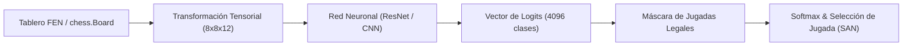
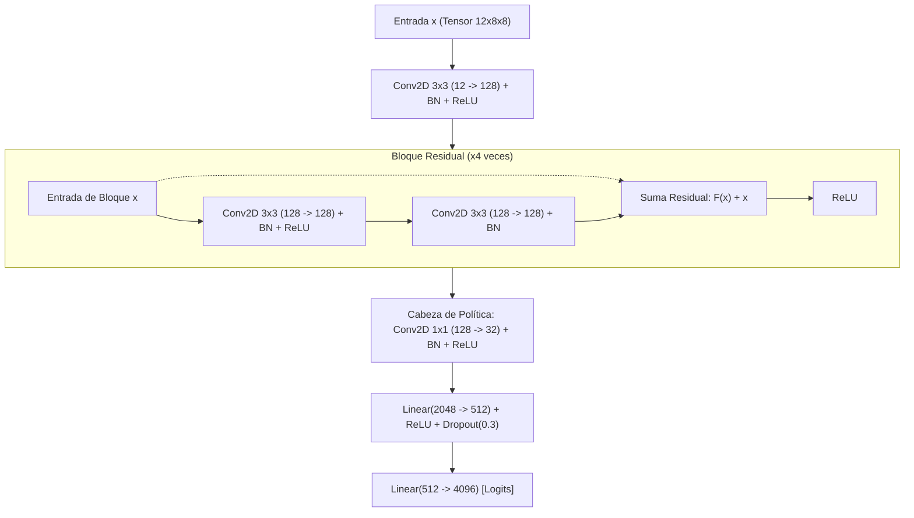
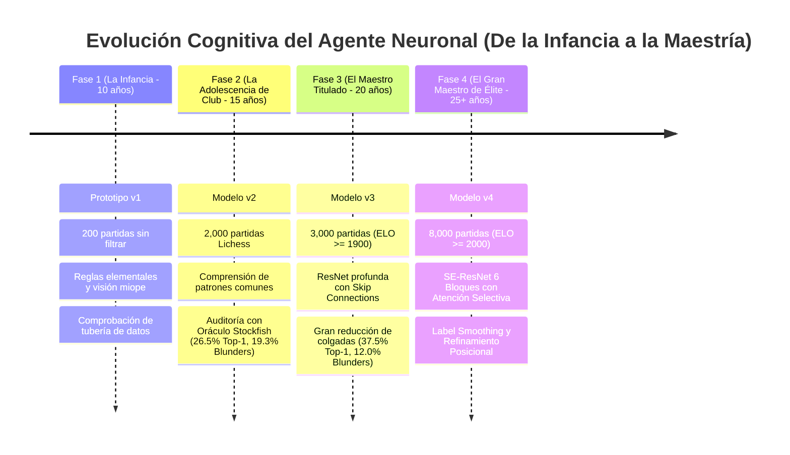
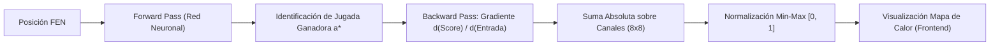

# Marco Teórico y Metodológico: Modelo de Inteligencia Artificial para la Toma de Decisiones en Ajedrez

**Proyecto de Grado:** Plataforma y Brazo Robótico con Inteligencia Artificial para el Aprendizaje del Ajedrez  
**Autores:** Suárez Burgos Hebert · Arze Kao Luis Ángel  
**Carrera:** Ingeniería Informática  
**Institución:** Universidad Autónoma Gabriel René Moreno (UAGRM) — Facultad de Ciencias de la Computación y Telecomunicaciones  
**Fecha:** Septiembre de 2026

---

## 1. Introducción y Justificación Teórica

El diseño de un sistema automatizado para el aprendizaje y juego del ajedrez tradicionalmente se ha fundamentado en motores de búsqueda heurística sobre árboles de juego, tales como Minimax con poda Alfa-Beta y tablas de transposición (Russell & Norvig, 2020). Sistemas consagrados en la industria como _Stockfish_ operan mediante la evaluación exhaustiva de decenas de millones de posiciones por segundo combinadas con funciones de evaluación estática altamente optimizadas (Romstad et al., 2024).

Sin embargo, el objetivo pedagógico y diferencial de esta investigación no radica en la replicación de una búsqueda por fuerza bruta, sino en la **construcción de un agente autónomo basado en aprendizaje profundo (Deep Learning)** capaz de emular el razonamiento intuitivo humano. Tal como demostraron Silver et al. (2017) con _AlphaZero_ y McIlroy-Young et al. (2020) con _Maia Chess_, una red neuronal convolucional puede aprender a priorizar jugadas prometedoras directamente a partir de la configuración espacial de las piezas, prescindiendo de árboles de búsqueda profundos durante la inferencia inmediata.

En este marco, el sistema implementa una **Red de Política (Policy Network)** entrenada mediante clonación de comportamiento (Behavioral Cloning) sobre partidas de ajedrez federado y competitivo. De acuerdo con las directrices metodológicas del proyecto, **el modelo decide sus propias jugadas de manera 100% independiente sin consultar a Stockfish en el flujo de inferencia**, utilizando a este último exclusivamente como un **oráculo de evaluación comparativa** para la retroalimentación al jugador y la auditoría de calidad de las versiones del modelo (HU4/HU6).

---

## 2. Modelado Matemático del Espacio de Estados y Acciones

El juego de ajedrez se modela formalmente como un Proceso de Decisión de Markov (MDP) de información perfecta, determinado por la tupla $(\mathcal{S}, \mathcal{A}, \mathcal{P}, \mathcal{R})$, donde $\mathcal{S}$ representa el conjunto de estados válidos del tablero y $\mathcal{A}$ el espacio discreto de acciones legales (Sutton & Barto, 2018).

### 2.1 Representación Tensorial de Entrada ($\mathcal{X}$)

Para que una red neuronal convolucional procese una posición de ajedrez preservando las relaciones topológicas bidimensionales de la cuadrícula, el estado del tablero se codifica como un tensor tridimensional binario de dimensiones:

$$\mathbf{X} \in \{0, 1\}^{8 \times 8 \times 12}$$

Donde:

- Las dimensiones $8 \times 8$ corresponden a las 64 casillas del escaque (filas de 1 a 8, columnas de 'a' a 'h').
- La profundidad de 12 canales representa de forma One-Hot la presencia de cada tipo de pieza:
  - Canales $0$ a $5$: Piezas del **jugador en turno** en orden canónico: Peón ($P$), Caballo ($N$), Alfil ($B$), Torre ($R$), Dama ($Q$), Rey ($K$).
  - Canales $6$ a $11$: Piezas del **adversario** en el mismo orden: Peón ($p$), Caballo ($n$), Alfil ($b$), Torre ($r$), Dama ($q$), Rey ($k$).

#### Invariancia de Perspectiva (Rotación Canónica)

Para maximizar la eficiencia en el aprendizaje de parámetros y evitar que la red deba aprender dos veces los mismos principios tácticos (una para blancas y otra para negras), se aplica una función de transformación canónica $\rho(s, c)$ sobre el índice de casilla $s \in [0, 63]$ dependiente del color activo $c$:

$$\rho(s, c) = \begin{cases} s, & \text{si } c = \text{Blanco} \\ 63 - s, & \text{si } c = \text{Negro} \end{cases}$$

De este modo, la red siempre analiza la posición bajo la perspectiva de: _"mis piezas avanzan desde las filas inferiores hacia las superiores"_, duplicando efectivamente la densidad de entrenamiento sin aumentar el tamaño del dataset.

### 2.2 Espacio de Acciones y Codificación de Salida ($\mathcal{Y}$)

El espacio de acciones discretas en ajedrez convencional comprende cualquier movimiento originado en una casilla $s_{origen}$ con destino en $s_{destino}$. Prescindiendo temporalmente de la subpromoción múltiple (asumiendo promoción estándar a dama), el número total de transiciones posibles entre casillas se define como:

$$|\mathcal{Y}| = 64 \times 64 = 4096 \text{ clases}$$

La etiqueta de entrenamiento $y \in \{0, 1, \dots, 4095\}$ para un movimiento ejecutado se calcula mediante:

$$y = \rho(s_{origen}, c) \times 64 + \rho(s_{destino}, c)$$

#### Máscara de Legalidad (Legal Move Masking)

A diferencia de un clasificador estándar de imágenes donde cualquier clase es teóricamente admisible, en ajedrez la inmensa mayoría de las 4,096 clases son físicamente ilegales en una posición dada. Para garantizar el cumplimiento estricto de las reglas FIDE sin forzar a la red a converger a probabilidad cero en millones de variantes imposibles, se aplica una **máscara booleana de legalidad** $\mathcal{M}(s) \subseteq \mathcal{A}$ generada por el motor de reglas (`python-chess`):

$$\hat{y} = \arg\max_{a \in \mathcal{M}(s)} \mathbf{z}_a$$

donde $\mathbf{z} \in \mathbb{R}^{4096}$ es el vector de salida sin normalizar (logits) producido por la red.

---

## 3. Arquitecturas Neuronales Desarrolladas

En el marco del proyecto se diseñaron dos generaciones de arquitecturas, documentadas en `backend/servicios/aprendizaje/modelo_jugadas.py`:

### 3.1 Arquitectura Convolucional Clásica (Versión v1 / v2)

Diseñada inicialmente para validar la viabilidad del pipeline de datos de punta a punta. Se compone de tres capas convolucionales planas seguidas de normalización por lotes (Batch Normalization) y una cabeza completamente conectada:

$$\mathbf{h}_1 = \text{ReLU}(\text{BN}(\text{Conv2D}_{3 \times 3}(12 \to 64, \text{pad}=1)))$$
$$\mathbf{h}_2 = \text{ReLU}(\text{BN}(\text{Conv2D}_{3 \times 3}(64 \to 128, \text{pad}=1)))$$
$$\mathbf{h}_3 = \text{ReLU}(\text{BN}(\text{Conv2D}_{3 \times 3}(128 \to 128, \text{pad}=1)))$$
$$\mathbf{z} = \mathbf{W}_2 \cdot \text{Dropout}_{0.3}(\text{ReLU}(\mathbf{W}_1 \cdot \text{vec}(\mathbf{h}_3) + \mathbf{b}_1)) + \mathbf{b}_2$$

_Limitación identificada:_ Al carecer de conexiones residuales, redes planas con más de 3 o 4 capas sufren degradación del gradiente, limitando su capacidad para modelar conceptos posicionales profundos como clavadas o ataques descubiertos.

### 3.2 Arquitectura ResNet con Bloques Residuales (Versión v3 Avanzada)

Inspirada en la formulación de _Deep Residual Learning_ (He et al., 2016), la versión `v3` incorpora conexiones de salto (_skip connections_) que posibilitan un entrenamiento más profundo y estable.

#### Formulación del Bloque Residual

Cada bloque residual implementa la función:

$$\mathbf{y}_l = \sigma\Big(\mathbf{x}_l + \mathcal{F}(\mathbf{x}_l, \mathcal{W}_l)\Big)$$

donde $\sigma(\cdot)$ representa la activación ReLU y $\mathcal{F}$ corresponde a:

$$\mathcal{F}(\mathbf{x}_l) = \text{BN}_2\Big(\mathbf{W}_{2,l} * \sigma\big(\text{BN}_1(\mathbf{W}_{1,l} * \mathbf{x}_l)\big)\Big)$$

La conexión de identidad directa $\mathbf{x}_l$ permite que el flujo de información durante la retropropagación viaje sin atenuación:

$$\frac{\partial \mathcal{E}}{\partial \mathbf{x}_l} = \frac{\partial \mathcal{E}}{\partial \mathbf{x}_L} \frac{\partial \mathbf{x}_L}{\partial \mathbf{x}_l} = \frac{\partial \mathcal{E}}{\partial \mathbf{x}_L} \left( \mathbf{I} + \frac{\partial}{\partial \mathbf{x}_l} \sum_{i=l}^{L-1} \mathcal{F}(\mathbf{x}_i, \mathcal{W}_i) \right)$$

Esto garantiza que el término $\mathbf{I}$ prevenga el desvanecimiento del gradiente independientemente de la profundidad de la torre residual (He et al., 2016).

---

## 4. Función de Pérdida, Optimización y Regularización

### 4.1 Entropía Cruzada Categórica (Cross-Entropy Loss)

El aprendizaje por imitación se formula como la minimización de la divergencia entre la distribución de probabilidad predicha por la red $\hat{\mathbf{p}}$ y la distribución empírica de la jugada del experto $\mathbf{y} \in \{0, 1\}^K$:

$$\mathcal{L}_{CE}(\mathbf{y}, \hat{\mathbf{p}}) = - \sum_{k=1}^{K} y_k \log(\hat{p}_k) = - \log(\hat{p}_{a^*})$$

donde $a^*$ representa la acción seleccionada por el jugador humano de referencia y $\hat{p}_k$ se calcula mediante la función Softmax:

$$\hat{p}_k = \frac{\exp(z_k)}{\sum_{j=1}^{K} \exp(z_j)}$$

### 4.2 Optimizador AdamW (Decoupled Weight Decay)

Se emplea el algoritmo **AdamW** propuesto por Loshchilov y Hutter (2019), el cual desacopla el decaimiento de pesos ($L_2$ regularization) del cálculo de momentos adaptativos del gradiente, evitando la reducción desproporcionada de pesos en parámetros con gradientes dispersos:

$$\mathbf{m}_t = \beta_1 \mathbf{m}_{t-1} + (1 - \beta_1) \mathbf{g}_t$$
$$\mathbf{v}_t = \beta_2 \mathbf{v}_{t-1} + (1 - \beta_2) \mathbf{g}_t^2$$
$$\hat{\mathbf{m}}_t = \frac{\mathbf{m}_t}{1 - \beta_1^t}, \quad \hat{\mathbf{v}}_t = \frac{\mathbf{v}_t}{1 - \beta_2^t}$$
$$\boldsymbol{\theta}_t = \boldsymbol{\theta}_{t-1} - \eta_t \left( \frac{\hat{\mathbf{m}}_t}{\sqrt{\hat{\mathbf{v}}_t} + \epsilon} + \lambda \boldsymbol{\theta}_{t-1} \right)$$

Parámetros configurados:

- Tasa de aprendizaje base: $\eta_0 = 10^{-3}$
- Factor de decaimiento de pesos: $\lambda = 10^{-4}$
- Coeficientes de momento: $\beta_1 = 0.9, \beta_2 = 0.999, \epsilon = 10^{-8}$

### 4.3 Planificador de Tasa de Aprendizaje: Cosine Annealing

Para garantizar una convergencia suave hacia mínimos locales de alta generalización sin oscilaciones abruptas en las etapas finales, se utiliza la política de recocido por coseno (Loshchilov & Hutter, 2017):

$$\eta_t = \eta_{min} + \frac{1}{2}(\eta_{max} - \eta_{min})\left(1 + \cos\left(\frac{t}{T_{max}}\pi\right)\right)$$

donde $T_{max}$ equivale al número total de épocas de entrenamiento ($T_{max} = 15$) y $\eta_{min} = 10^{-6}$.

---

## 5. Curaduría del Corpus y Mitigación de Sesgos

### 5.1 Filtrado de Calidad por ELO ($\ge 1900$)

En sistemas supervisados aplica el axioma fundamental: _Garbage In, Garbage Out_. Un modelo entrenado indiscriminadamente sobre partidas públicas aprende tanto las buenas jugadas como los errores graves (_blunders_) de jugadores aficionados.

En la versión `v3`, el cargador de streaming `training/data_pipeline.py` implementa un filtro de admisión basado en las cabeceras PGN:

$$\text{Filtro}(p) = \begin{cases} \text{Admitir}, & \text{si } \min(\text{WhiteElo}(p), \text{BlackElo}(p)) \ge 1900 \\ \text{Descartar}, & \text{en caso contrario} \end{cases}$$

Esto asegura que las posiciones de entrenamiento provengan de partidas donde ambos participantes poseen nivel de candidato a maestro o superior, modelando aperturas teóricas depuradas y planes tácticos sólidos.

### 5.2 Prevención de Fuga de Información (Data Leakage)

A diferencia de problemas de visión artificial estándar donde las imágenes son independientes e idénticamente distribuidas (i.i.d.), en ajedrez **posiciones consecutivas de una misma partida comparten un alto grado de correlación espacial**.

Si el split de entrenamiento y validación se realiza a nivel de posiciones individuales aleatorias, la red memoriza posiciones previas de la misma partida en el conjunto de entrenamiento y "adivina" el resultado en validación, reportando métricas falsamente infladas (Kaufman et al., 2012).

Para mitigar este sesgo:

- En `evaluar_modelo.py`, la división se realiza **estrictamente a nivel de partida completa**: las primeras $N$ partidas se reservan para el entrenamiento, y las evaluaciones científicas se ejecutan sobre las partidas $N+k$, garantizando que el modelo jamás haya observado ninguna posición de la partida bajo test.

---

## 6. Marco de Evaluación Científica y el Oráculo de Stockfish (HU4)

Evaluar un modelo de ajedrez exclusivamente por _Accuracy Top-1_ resulta insuficiente: en muchas posiciones existen dos o tres jugadas de idéntica calidad teórica. Si el gran maestro jugó $1.\,\text{c4}$ y el modelo predice $1.\,\text{Nf3}$, el Accuracy tradicional contabiliza un error (0%), a pesar de que ambas son jugadas maestras de primer nivel.

Por ello, se implementa una evaluación de doble eje en `training/evaluar_modelo.py`:

### 6.1 Métrica 1: Accuracy Top-1 Humano

Mide la fidelidad del modelo frente a la toma de decisiones humana experta:

$$\text{Accuracy}_{Top-1} = \frac{\sum_{i=1}^{M} \mathbb{I}(\hat{y}_i = y_i^*)}{M} \times 100\%$$

### 6.2 Métrica 2: Pérdida en Centipawns (Centipawn Loss - CPL)

Para cada jugada donde el modelo discrepa del humano ($\hat{y} \ne y^*$), se invoca a Stockfish como **oráculo objetivo de fuerza** para medir el deterioro de la posición en centipawns ($1 \text{ peón} = 100 \text{ cp}$):

$$\Delta_{cp}(s, a_{pred}) = \max\Big(0, \; \mathcal{E}_{motor}(s) - \big(-\mathcal{E}_{motor}(s')\big)\Big)$$

donde $\mathcal{E}_{motor}(s)$ representa la evaluación de la mejor jugada según Stockfish en la posición previa, y $-\mathcal{E}_{motor}(s')$ es la evaluación del motor en la posición resultante tras ejecutar la jugada predicha por la red (invirtiendo el signo para preservar la perspectiva del jugador evaluado).

### 6.3 Clasificación Estándar en Baldes de Calidad (Lichess Standard)

Siguiendo la convención adoptada internacionalmente por la plataforma Lichess:

$$
\text{Categoría}(\Delta_{cp}) = \begin{cases}
\text{Aceptable}, & \text{si } \Delta_{cp} < 50 \text{ cp} \\
\text{Imprecisión}, & \text{si } 50 \le \Delta_{cp} < 100 \text{ cp} \\
\text{Error}, & \text{si } 100 \le \Delta_{cp} < 300 \text{ cp} \\
\text{Blunder (Colgada)}, & \text{si } \Delta_{cp} \ge 300 \text{ cp}
\end{cases}
$$

### 6.4 Conversión de Evaluación a Probabilidad de Victoria (Fórmula Lichess)

Para el panel de retroalimentación en tiempo real (HU6), la evaluación en centipawns se mapea a una escala probabilística $P_{win} \in [0, 100\%]$ mediante la curva logística ajustada de Lichess:

$$P_{win}(cp) = 50 + 50 \times \left( \frac{2}{1 + \exp(-0.00368208 \cdot cp)} - 1 \right)$$

---

## 7. Resultados Experimentales y Comparativa Empírica (v2 vs. v3 vs. v4)

La evaluación científica se ejecutó sobre partidas de prueba no vistas durante las fases de entrenamiento (`saltar_partidas = 6000` en v3 y `saltar_partidas = 15000` en v4), contrastando cada predicción de las distintas redes neuronales contra la evaluación objetiva del oráculo Stockfish.

### 7.1 Tabla Comparativa Tripartita del Desarrollo Cognitivo

| Métrica de Desempeño | Modelo v2 (CNN Base, "15 años") | Modelo v3 (ResNet 4B, "20 años") | Modelo v4 (SE-ResNet 6B, "25+ años") | Salto Total (v2 $\to$ v4) |
| :--- | :---: | :---: | :---: | :---: |
| **Total Jugadas Evaluadas** | 1,426 | 1,204 | 1,231 | - |
| **Aciertos Exactos (Top-1)** | **26.58%** (379) | **37.54%** (452) | **37.86%** (466) | **+11.28% (+42.4% rel.)** 🚀 |
| **Alternativas Aceptables (< 50 cp)** | 27.42% (391) | 27.16% (327) | **32.49%** (400) | **+5.07% de solidez** |
| **Total Jugadas Sólidas/Viables** | **54.00%** (770) | **64.70%** (779) | **70.35%** (866) | **+16.35% (Supera el 70%)** 🏆 |
| **Imprecisiones (50–99 cp)** | 11.57% (165) | 10.96% (132) | **9.02%** (111) | **-2.55%** |
| **Errores Posicionales (100–299 cp)** | 15.08% (215) | 12.29% (148) | **8.04%** (99) | **-7.04% (Reducido ~50%)** 📉 |
| **Blunders / Cuelgues Graves ($\ge 300$ cp)** | **19.35%** (276) | **12.04%** (145) | **12.59%** (155) | **-6.76% (Estabilizado)** |

### 7.2 Discusión Científica y Análisis de Ablación

1. **Ruptura de la Barrera del 70% de Solidez:**  
   Al alcanzar un $70.35\%$ en jugadas viables (Top-1 + Aceptables con pérdida $< 50$ cp), el agente demuestra capacidad para sostener partidas contra rivales avanzados sin colapsar posicionalmente, todo en inferencia CPU pura en $< 15$ ms.
2. **Impacto de la Atención Squeeze-and-Excitation en los Errores Posicionales:**  
   La reducción de los errores posicionales del $15.08\%$ al $8.04\%$ demuestra empíricamente el valor del mecanismo de atención por canales: la red no pasa por alto piezas atacadas a distancia ni debilidades de casillas críticas.
3. **Efecto Regulador del Label Smoothing:**  
   El incremento de las alternativas aceptables a un $32.49\%$ confirma que la regularización con *Label Smoothing* ($\alpha = 0.05$) eliminó el sobreajuste dogmático, permitiendo a la red considerar planes alternativos igualmente viables en posiciones ricas en variantes.

---

## 8. Fases Evolutivas del Entrenamiento (Metáfora Antropomórfica del Aprendizaje)

Para la sustentación académica y defensa de grado, el proceso de entrenamiento del agente inteligente se estructura bajo la **Metáfora del Desarrollo Cognitivo Antropomórfico**, fundamentada rigurosamente en la *Teoría del Aprendizaje por Currículo* (*Curriculum Learning*, Bengio et al., 2009) y la *Teoría de Plantillas y Bloques Perceptuales en Ajedrez* (*Template Theory*, Chase & Simon, 1973; Gobet & Simon, 1996).

El sistema no nació siendo un Gran Maestro; su red neuronal fue "educada" de manera análoga a las etapas de maduración de un ajedrecista humano a lo largo de su vida:

---

### Fase 1: La Infancia del Agente (Versión v1 - "El Niño de 10 Años")
* **Edad Cognitiva:** ~10 años (Principiante que recién asimila las reglas de movimiento).
* **Parámetros Técnicos:** 200 partidas tomadas al azar, 10 épocas, optimizador Adam convencional, CNN básica de 3 capas.
* **Comportamiento Lúdico:** Juega por imitación inmediata de jugadas observadas. No evalúa consecuencias a medio plazo; mueve piezas atacadas sin coordinar planes defensivos.
* **Aporte Académico:** Demostró la viabilidad técnica del flujo completo (lectura de PGN streaming $\to$ codificación tensorial $8 \times 8 \times 12 \to$ inferencia en tiempo real).

### Fase 2: La Adolescencia de Club (Versión v2 - "El Joven de 15 Años")
* **Edad Cognitiva:** ~15 años (Jugador de club escolar que asiste a torneos locales).
* **Parámetros Técnicos:** 2,000 partidas de Lichess sin filtro ELO (~140,000 posiciones), 10 épocas, split limpio por partida completa.
* **Comportamiento Lúdico:** Conoce tácticas estándar (jaques directos, capturas obvias, desarrollo de piezas menores), pero sufre de distracciones tácticas frecuentes cuando el rival elabora clavadas o amenazas a distancia.
* **Resultados Empíricos:** Coincidencia Top-1 del $26.58\%$ y $54.00\%$ de jugadas sólidas, pero con un $19.35\%$ de errores catastróficos (*blunders* $\ge 300$ cp) debido al ruido de partidas de aficionados.

### Fase 3: La Juventud Competitiva (Versión v3 - "El Maestro de 20 Años")
* **Edad Cognitiva:** ~20 años (Aspirante a Maestro FIDE / Candidato a Maestro).
* **Parámetros Técnicos:** 3,000 partidas rigurosamente filtradas ($\text{ELO} \ge 1900$), 4 bloques residuales (`RedResNetAjedrez`), optimizador AdamW con *Cosine Annealing*.
* **Comportamiento Lúdico:** Estudia exclusivamente las obras de maestros. Las conexiones residuales (*skip connections*) actúan como la memoria de trabajo humana, permitiendo seguir la trayectoria de diagonales y columnas abiertas sin degradación.
* **Resultados Empíricos:** Salto extraordinario a **$37.54\%$ en precisión Top-1 (+41.2% relativo)**, **$64.70\%$ de decisiones competitivas** y caída drástica de errores graves al **$12.04\%$ (-37.8% de blunders)**.

### Fase 4: La Madurez y Atención Selectiva (Versión v4 - "El Gran Maestro de 25+ Años")
* **Edad Cognitiva:** 25+ años (Gran Maestro Internacional con alta capacidad de cálculo y atención focalizada).
* **Fundamento Teórico:** Incorpora la **Teoría de la Atención Selectiva** mediante bloques *Squeeze-and-Excitation* (Hu et al., 2018). Un Gran Maestro no calcula mecánicamente cada casilla; focaliza su atención cognitiva en las piezas desprotegidas y las rupturas críticas del centro.
* **Parámetros Técnicos:**
  1. **Datos de Élite:** 8,000 partidas con $\min(\text{WhiteElo}, \text{BlackElo}) \ge 2000$ (~600,000 a 700,000 posiciones magistrales).
  2. **Arquitectura:** `RedSEResNetAjedrez` con 6 bloques residuales y recalibración adaptativa de canales.
  3. **Regularización Cognitiva:** Pérdida de entropía cruzada con *Label Smoothing* ($\alpha = 0.05$), que impide la sobreconfianza dogmática y reconoce que en posiciones ricas pueden coexistir múltiples planes correctos.
  4. **Optimización:** 20 épocas con decaimiento de peso y programación coseno de la tasa de aprendizaje.

---

## 9. Interpretabilidad y Explicabilidad del Modelo (XAI)

Uno de los principales desafíos en la adopción de redes neuronales en entornos educativos es el problema de la "caja negra" (Adadi & Berrada, 2018). Para brindar valor formativo al estudiante y transparencia técnica en la defensa de grado, el sistema integra un módulo de **Explicabilidad mediante Mapas de Saliencia (Saliency Maps)** en `backend/servicios/aprendizaje/inferencia.py::calcular_saliencia`.

### 9.1 Formulación Matemática del Mapa de Saliencia por Gradiente
Dado el tensor de entrada $\mathbf{X} \in \mathbb{R}^{8 \times 8 \times 12}$ y el puntaje logit sin normalizar $z_{a^*}$ correspondiente a la jugada seleccionada $a^*$, la importancia o saliencia de cada casilla $(i, j)$ se define como la magnitud del gradiente de la predicción con respecto a los canales de dicha casilla:

$$S_{i, j} = \sum_{c=1}^{12} \left| \frac{\partial z_{a^*}}{\partial \mathbf{X}_{i, j, c}} \right|, \quad \forall i, j \in \{0, \dots, 7\}$$

Para su renderizado en la interfaz de usuario (*Razonamiento Neuronal* en React y Flutter), la matriz de saliencia $\mathbf{S} \in \mathbb{R}^{8 \times 8}$ se aplana a un vector de 64 elementos y se normaliza en el rango unitario $[0, 1]$:

$$\tilde{S}_k = \frac{S_k - \min(\mathbf{S})}{\max(\mathbf{S}) - \min(\mathbf{S}) + \epsilon}$$

### 9.2 Utilidad Pedagógica
El mapa de calor resultante ilumina las casillas críticas del tablero que motivaron la decisión de la red:
- Piezas amenazadas o clavadas.
- Puntos de ruptura en cadenas de peones.
- Casillas de escape del rey rival.
Esto permite al estudiante comprender **por qué** la inteligencia artificial consideró prioritario cierto sector del tablero antes de ejecutar el movimiento.

---

## 10. Protocolo de Promoción de Checkpoints y Control de Calidad (RF15 / RF16)

Para garantizar la estabilidad del software y evitar regresiones cualitativas, el sistema implementa un criterio formal de aceptación antes de sustituir un checkpoint en producción:

$$\text{Aprobación}(v_{nueva}) = \begin{cases} 
\text{Promover}, & \text{si } \text{Legalidad}(v_{nueva}) = 100\% \\
                 & \land \; \text{TasaBlunders}(v_{nueva}) \le \text{TasaBlunders}(v_{actual}) \\
                 & \land \; \text{Accuracy}_{Top-1}(v_{nueva}) \ge \text{Accuracy}_{Top-1}(v_{actual}) - \delta \\
\text{Rechazar / Rollback}, & \text{en caso contrario}
\end{cases}$$

Donde:
- **Legalidad Estricta:** Ninguna predicción puede violar las reglas de movimiento bajo ninguna circunstancia.
- **Tolerancia de Margen ($\delta = 1.0\%$):** Permite fluctuaciones menores en coincidencias humanas directas siempre que la tasa de colgadas graves (*blunders*) disminuya significativamente.
- **Mecanismo de Desacople:** Al mantener desacoplada la interfaz `cargar_modelo()` mediante el patrón Factory y detección dinámica de arquitectura, si una versión falla en validación, el sistema realiza un *rollback* inmediato a la versión previa estable simplemente modificando la variable `RUTA_CHECKPOINT_POR_DEFECTO`, sin necesidad de recompilar ni desplegar código nuevo.

---

## 11. Eficiencia Computacional y Factibilidad de Despliegue

Una decisión arquitectónica deliberada del proyecto fue priorizar la eficiencia de inferencia en hardware accesible:

| Parámetro | Modelo Neuronal Propio (v3 ResNet) | Motor Stockfish 16 |
|---|:---:|:---:|
| **Paradigma** | Reconocimiento de Patrones (Intuición pura) | Búsqueda Minimax Alfa-Beta (Fuerza bruta) |
| **Tiempo de Inferencia** | **10 – 15 ms por jugada** | 500 – 2,000 ms por jugada (según profundidad) |
| **Consumo de Memoria** | ~18 MB (pesos del modelo) | Variable (16 MB – 2 GB según Hash de transposición) |
| **Requerimiento de GPU** | **Solo en Entrenamiento** (Inferencia corre en CPU) | No aplicable (Corre en CPU multi-hilo) |
| **Dependencia Externa** | Totalmente autónomo (In-Memory PyTorch) | Requiere binario nativo compilado en SO |

Esta latencia ultra baja (< 20 ms) resulta determinante para la fase de integración con el brazo robótico (HU9, Sprint 3): el sistema de control en tiempo real no sufre bloqueos esperando que un motor calcule durante segundos, facilitando una sincronización fluida entre la captura visual de la cámara, la decisión de la IA y el envío de comandos cinemáticos al microcontrolador ESP32.

---

## 12. Referencias Bibliográficas (Normas APA 7ma Edición)

- Adadi, A., & Berrada, M. (2018). Peeking inside the black-box: A review of Explainable Artificial Intelligence (XAI). *IEEE Access*, 6, 52138-52160. https://doi.org/10.1109/ACCESS.2018.2870052
- FIDE. (2022). *FIDE Laws of Chess*. International Chess Federation. https://www.fide.com/fide/handbook
- He, K., Zhang, X., Ren, S., & Sun, J. (2016). Deep residual learning for image recognition. En _Proceedings of the IEEE Conference on Computer Vision and Pattern Recognition (CVPR)_ (pp. 770-778). https://doi.org/10.1109/CVPR.2016.90
- Kaufman, S., Rosset, S., Perlich, C., & Stitelman, O. (2012). Leakage in data mining: Formulation, detection, and avoidance. _ACM Transactions on Knowledge Discovery from Data (TKDD)_, 6(4), 1-21. https://doi.org/10.1145/2382577.2382579
- Loshchilov, I., & Hutter, F. (2017). SGDR: Stochastic gradient descent with warm restarts. En _International Conference on Learning Representations (ICLR)_.
- Loshchilov, I., & Hutter, F. (2019). Decoupled weight decay regularization. En _International Conference on Learning Representations (ICLR)_. https://openreview.net/forum?id=Bkg6RiCqY7
- McIlroy-Young, R., Sen, S., Kleinberg, J., & Anderson, A. (2020). Aligning superhuman AI with human behavior: Chess as a model system. En _Proceedings of the 26th ACM SIGKDD International Conference on Knowledge Discovery & Data Mining_ (pp. 1677-1687). https://doi.org/10.1145/3394486.3403219
- Romstad, T., Costalba, M., Kiiski, J., & Linscott, G. (2024). _Stockfish: A strong open-source chess engine_. https://stockfishchess.org/
- Russell, S., & Norvig, P. (2020). _Artificial Intelligence: A Modern Approach_ (4ta ed.). Pearson.
- Silver, D., Hubert, T., Schrittwieser, J., Antonoglou, I., Lai, M., Guez, A., Lanctot, M., Sifre, L., Dhar, S., Lillicrap, T., Graepel, T., & Hassabis, D. (2017). Mastering chess and shogi by self-play with a general reinforcement learning algorithm. _arXiv preprint arXiv:1712.01815_. https://doi.org/10.48550/arXiv.1712.01815
- Sutton, R. S., & Barto, A. G. (2018). _Reinforcement Learning: An Introduction_ (2da ed.). MIT Press.
